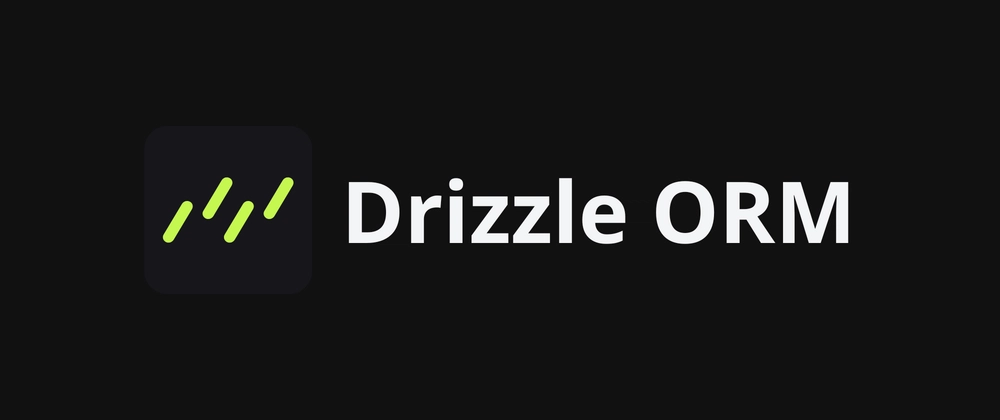

# YouTube Learnings.

## NodeJS

### <span style="color: #9c9c9c"><u>nodejs: 01.</u></span> [Build Scalable REST API with Node Js](https://youtu.be/RDM-nk5f4SE)

### Learning goals:

- Setup a new **NodeJs** Project with **typescript**
- ExpressJs: Routes, Controllers, Middlewares
- Build a REST API for e-commers with Products & Orders CRUD
- User Authentication & Autherisation
- **Drizzel ORM** with postgres Database
- Request validation and error handling
- Deploy to production on **Genezio**

---

### Tech Stacks:

<p align="center" style="margin: 1rem" width="100%" style="background-size: cover;">
  
  
  
  
  
</p>

<p align="center" style="margin: 1rem">

  
</p>

---

### Install Dependancies:

Express:

```bash
npm install express
```

TypeScript and Express Types:

```bash
npm install -D typescript tsx @types/express
```

TS config file:

```json
{
  "compilerOptions": {
    "module": "esnext", // use ESNEXT for ESM
    "target": "es2020", // target moden ECMAScript versions
    "moduleResolution": "node",
    "esModuleInterop": true,
    "allowSyntheticDefaultImports": true,
    "outDir": "./dist", // output directory of compiled files
    "strict": true, // enable strict type chaking options
    "skipLibCheck": true, //skip type chaking of declaration files
    "resolveJsonModule": true, // include json imports
    "forceConsistentCasingInFileNames": true,
    "noEmit": false, // allow emitting output
    "isolatedModules": true, // required for using ESM modules
    "baseUrl": ".", // allow absolute imports relative to project root
    "paths": {
      "*": ["node-modules/*"]
    }
  }
}
```

Config `package.json` run command:

```json
{
+   "type": "module",
    "scripts": {
      "test": "echo \"Error: no test specified\" && exit 1",
+    "dev": "node --import=tsx --watch ./src/app.ts",
+    "build": "tsc"
  },
}
```

**Note:** _NodeJs_ by default provides these features, we don't need to install `nodemon` etc.

---

### Middlewares:

A **middleware** is a function that has access to the request (req), response (res), and the next middleware function in the application’s request-response cycle.

It’s used to process requests before they reach the route handler or after the response is sent.

_**Middleware** allows us to **add additional functionalities** between controllers and routers as we handle the requset._

**Middleware Signature:**

```typescript
function middlewareFn(req, res, next) {
  // Do something with req or res
  next(); // Pass control to the next middlewares
}
```

**Use Cases:**

1. **<u>Parsing request bodies:</u>** Parses `json` payloads.

```typescript
app.use(express.json());
```

2. **<u>URL encoded:</u>** Returns middleware that only parses urlencoded bodies and only looks at requests where the Content-Type header matches the type option.

```typescript
app.use(urlencoded({ extended: false }));
```

---

### Database & Drizzle ORM

We can connect `postgresql` database in a multiple ways

### Data Validation with ZOD

Handle the query paramete validations. Add a validation rules

#### **drizzle-zod**

drizzle-zod is a plugin for [Drizzle ORM](https://github.com/drizzle-team/drizzle-orm) that allows you to generate [Zod](https://github.com/colinhacks/zod) schemas from Drizzle ORM schemas.

```bash
npm install drizzle-zod
```
